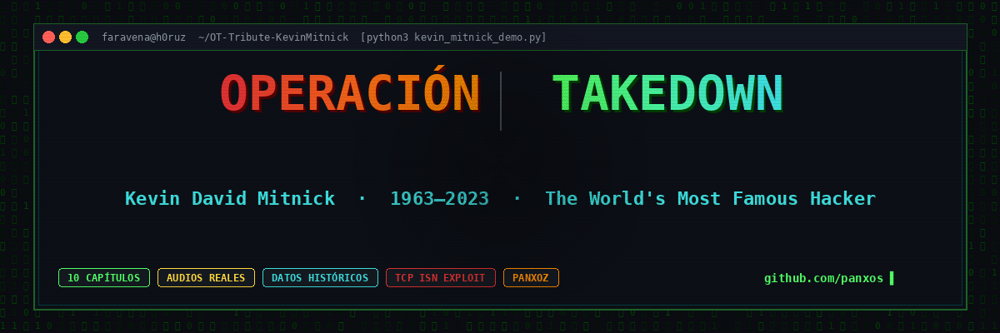
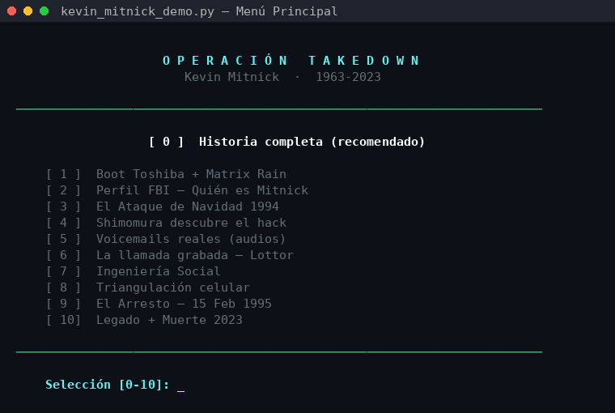
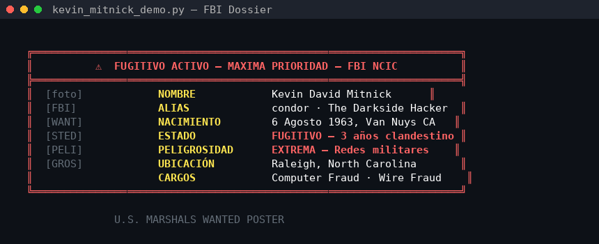
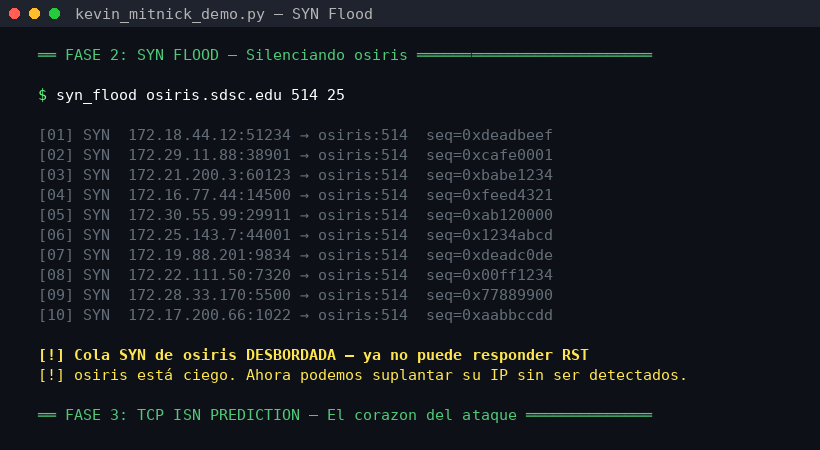
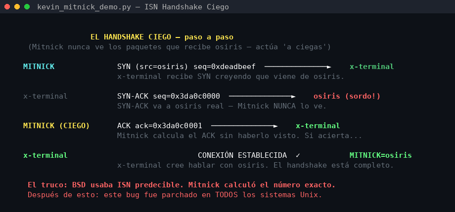
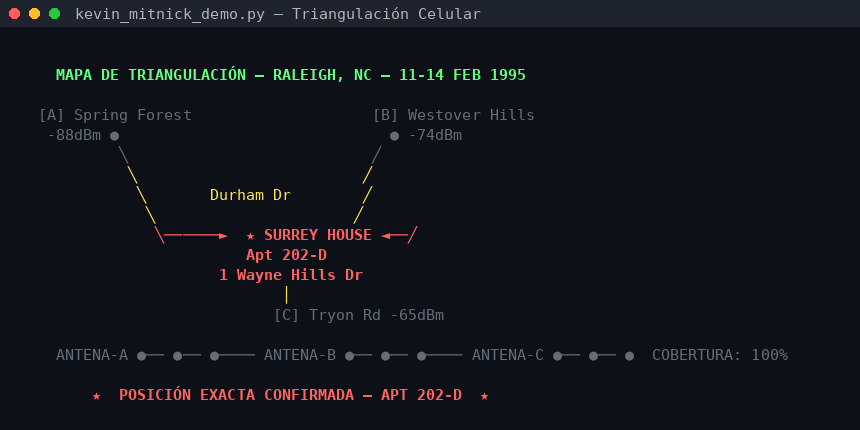
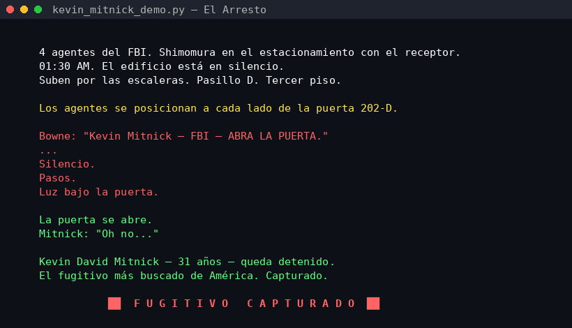

<div align="center">

[](https://python.org)
[](LICENSE)
[](https://github.com/panxos/OT-Tribute-KevinMitnick)
[](https://pipewire.org)
[](https://github.com/panxos/OT-Tribute-KevinMitnick/stargazers)

**Demo educativo de terminal sobre el hacker más famoso de la historia.**  
Datos históricos reales · Audios reales · TCP ISN exploit animado · 2,400+ líneas de Python puro.

[Características](#características) · [Requisitos](#requisitos) · [Instalación](#instalación) · [Uso](#uso) · [Capítulos](#capítulos) · [Créditos](#créditos)

</div>

---

## ¿Qué es esto?

**Operación Takedown** es un demo interactivo de terminal que recorre la historia real de Kevin Mitnick — el fugitivo más buscado de América — desde el *Ataque de Navidad de 1994* hasta su arresto el 15 de febrero de 1995.

Diseñado originalmente como presentación educativa para estudiantes de secundaria, incluye:

- **Audios reales** de los voicemails capturados por Shimomura (fuente: takedown.com)
- **La llamada grabada** entre Mitnick y Mark Lottor, días antes del arresto
- **Simulación técnica** del ataque TCP ISN Prediction (RFC 6528) con diagrama animado
- **Efectos visuales** de matriz, glitch, triangulación celular y más
- **Síntesis PCM** de audio completa — sin archivos de audio para los efectos
- **Fotografías** del dossier FBI y legado, renderizadas con Chafa en ANSI

---

## Capturas de pantalla

<table>
<tr>
<td width="50%">

<p align="center"><sub>Menú de capítulos con skip directo</sub></p>
</td>
<td width="50%">

<p align="center"><sub>Dossier FBI — Fugitivo Activo</sub></p>
</td>
</tr>
<tr>
<td width="50%">

<p align="center"><sub>SYN Flood — Fase 2 del ataque</sub></p>
</td>
<td width="50%">

<p align="center"><sub>TCP ISN Prediction — Handshake ciego animado</sub></p>
</td>
</tr>
<tr>
<td width="50%">

<p align="center"><sub>Triangulación celular — Surrey House, Raleigh NC</sub></p>
</td>
<td width="50%">

<p align="center"><sub>15 Febrero 1995 — 01:30 AM — Apt 202-D</sub></p>
</td>
</tr>
</table>

---

## Características

### Visual
- 🌧 **Matrix rain** ASCII al inicio con overlay de texto
- ⚡ **Glitch screen** con caracteres corruptos antes de eventos críticos
- 🗺 **Mapa de triangulación** celular animado (Raleigh, NC)
- 📊 **Timeline horizontal** de vida de Mitnick (1963–2023) con períodos coloreados
- 📟 **Hexdump scrolling** de tráfico de red capturado por /dev/tap
- 🖼 **Fotos** del dossier FBI y legado renderizadas en ANSI (requiere `chafa`)

### Audio
- 🔊 **Audios reales** de los 6 voicemails de takedown.com (con skip en vuelo)
- 📞 **Llamada Lottor** — 10 segmentos de la grabación real (con skip en vuelo)
- ⌨ **Sonido de teclado mecánico** por cada tecla tipeda en terminal
- 🎵 **Síntesis PCM** de tono, sweep, DTMF, modem, heartbeat, crescendo de tensión
- 📢 **TTS** via espeak-ng para efectos de voz

### Técnico
- 🔢 **Diagrama ISN animado** — handshake ciego TCP paso a paso
- 💻 **Simulación terminal** completa con prompt, comandos y output real
- 🎭 **Ingeniería Social** — 5 escenarios con transcripciones reales
- 📡 **Análisis forense** de Shimomura con timestamps exactos

### UX
- 📋 **Menú de capítulos** — salta directo al que necesitas
- ⚡ **Modo rápido** — velocidad x2 para demos cortas
- 🔇 **Modo sin audio** — para proyectores sin sonido
- 🚀 **--chapter N** — acceso directo desde línea de comandos
- ✅ **Asset checker** — avisa qué archivos faltan antes de iniciar

---

## Requisitos

### Sistema operativo
- Linux (Arch, Ubuntu, Debian, Fedora) o macOS
- Terminal de mínimo 80 columnas × 24 líneas — se recomienda 120×40

### Dependencias de sistema

| Paquete | Uso | Obligatorio |
|---------|-----|-------------|
| `python3 >= 3.8` | Intérprete | ✅ |
| `paplay` (pulseaudio-utils / pipewire-pulse) | Reproducción de audio WAV | ✅ |
| `espeak-ng` | Síntesis de voz TTS | ✅ |
| `chafa` | Fotos ANSI en terminal | Recomendado |

### Instalación de dependencias

**Arch Linux / Manjaro:**
```bash
sudo pacman -S python espeak-ng chafa libpulse
```

**Ubuntu / Debian:**
```bash
sudo apt install python3 espeak-ng chafa pulseaudio-utils
```

**Fedora:**
```bash
sudo dnf install python3 espeak-ng chafa pulseaudio-utils
```

**macOS (Homebrew):**
```bash
brew install espeak chafa
# paplay no disponible en macOS — instala afplay o usa --no-audio
```

---

## Instalación

```bash
git clone https://github.com/panxos/OT-Tribute-KevinMitnick.git
cd OT-Tribute-KevinMitnick
```

### Audio opcional (audios reales del caso)

Los archivos WAV de los voicemails y la llamada Lottor **no se incluyen en el repo** por tamaño y derechos. Son audios históricos públicos disponibles en [takedown.com](https://takedown.com):

```
audio/
├── voicemail/
│   ├── th1.wav  →  th6.wav    # 6 mensajes de voz — Shimomura recibe llamadas
└── lottor/
    ├── seg1.wav  →  seg10.wav  # Llamada grabada entre Kevin y Mark Lottor
```

Sin estos archivos, el demo reproduce efectos de sonido sintéticos como fallback. Todo lo demás funciona igual.

---

## Uso

### Historia completa (recomendado)

```bash
python3 kevin_mitnick_demo.py
```

Al iniciar aparece el menú de capítulos — escribe `0` + Enter para la historia completa.

### Opciones de línea de comandos

```
usage: kevin_mitnick_demo.py [-h] [--fast] [--no-audio] [--chapter N]

options:
  --fast       Velocidad x2 — ideal para demos rápidas (presentaciones)
  --no-audio   Sin audio — para proyectores sin sonido
  --chapter N  Salta directo al capítulo N (1-10)
```

### Ejemplos

```bash
# Ir directo al ataque de Navidad (capítulo 3)
python3 kevin_mitnick_demo.py --chapter 3

# Presentación rápida sin audio (proyector)
python3 kevin_mitnick_demo.py --fast --no-audio

# Solo el arresto, modo rápido
python3 kevin_mitnick_demo.py --chapter 9 --fast

# Historia completa, normal
python3 kevin_mitnick_demo.py --chapter 0
```

### Durante la reproducción

| Tecla | Acción |
|-------|--------|
| `ENTER` | Avanzar al siguiente capítulo / escena |
| `ENTER` (durante audio) | Saltar el audio actual |
| `Ctrl+C` | Salir limpiamente |

---

## Capítulos

| # | Título | Contenido |
|---|--------|-----------|
| 1 | Boot Toshiba + Matrix | BIOS del Toshiba T1960CS, conexión modem, matrix rain |
| 2 | Perfil FBI | Dossier completo con foto, datos, cargos federales |
| 3 | El Ataque de Navidad | SYN Flood + TCP ISN Prediction — 25 Dic 1994 |
| 4 | Shimomura descubre | Análisis forense, hexdump de tráfico, línea de tiempo |
| 5 | Voicemails reales | 6 mensajes grabados por Shimomura (audios de takedown.com) |
| 6 | La llamada Lottor | Conversación grabada donde Mitnick menciona a Shimomura |
| 7 | Ingeniería Social | 5 escenarios + sistemas comprometidos + The WELL BBS |
| 8 | Triangulación celular | Mapa animado — Sprint Cellular + TSCM — Surrey House |
| 9 | El Arresto | 15 Feb 1995, 01:30 AM, Apt 202-D, glitch + crescendo |
| 10 | Legado + Muerte | Timeline 1963-2023, libros, tributos, FREE KEVIN |

---

## El hack que cambió Internet

El *Ataque de Navidad de 1994* fue el primer exploit documentado de **TCP ISN Prediction** ejecutado en producción:

```
MITNICK              SYN (src=osiris.sdsc.edu) seq=0xDEADBEEF
─────────────────────────────────────────────────────────────► x-terminal

x-terminal           SYN-ACK seq=0x3DA0C000
─────────────────────────────────────────────────────────────► osiris (ciego)

MITNICK (A CIEGAS)   ACK ack=0x3DA0C001   ← calculado sin verlo
─────────────────────────────────────────────────────────────► x-terminal

                     ✓ CONEXIÓN ESTABLECIDA — como si fuera osiris
```

La vulnerabilidad fue descrita por Robert T. Morris en 1985 (BSD 4.2). Nadie la había ejecutado en la vida real hasta ese 25 de diciembre. Fue parcheada mediante números ISN aleatorios (RFC 6528, 2012).

---

## Fuentes históricas

Todos los datos son verificables y públicos:

- **[takedown.com](https://takedown.com)** — Shimomura's forensic analysis, voicemails, transcripts
- **USA v. Mitnick, CR-95-0132-RMT** — Registros judiciales federales
- **Ghost in the Wires** — Kevin Mitnick, 2011 (autobiografía)
- **Morris (1985)** — *A Weakness in the 4.2BSD UNIX TCP/IP Software*
- **RFC 6528** — Defending Against Sequence Number Attacks (2012)
- **Netcom logs** — Evidencia del caso federal, dominio público

---

## Estructura del proyecto

```
OT-Tribute-KevinMitnick/
├── kevin_mitnick_demo.py      # Demo principal (~2,470 líneas)
├── generate_screenshots.py    # Genera screenshots para el README
├── generate_logo.py           # Genera el logo PNG
├── requirements.txt           # Dependencias de sistema
├── LICENSE                    # MIT
├── .gitignore
├── screenshots/               # Imágenes para el README
│   ├── logo.png
│   ├── 01_menu.png
│   ├── 02_fbi_dossier.png
│   ├── 03_syn_flood.png
│   ├── 04_isn_diagram.png
│   ├── 05_triangulacion.png
│   ├── 06_arresto.png
│   └── 07_credits.png
├── audio/                     # ← NO incluido en git (ver .gitignore)
│   ├── voicemail/th{1-6}.wav
│   └── lottor/seg{1-10}.wav
├── transcripts/               # Transcripciones HTML de takedown.com
└── mitnick.jpg                # U.S. Marshals Wanted Poster (dominio público)
```

---

## Créditos

<div align="center">

**Creado por [faravena](https://github.com/panxos) (P4nx0z)**

[](https://github.com/panxos)
[](https://www.linkedin.com/in/faravena/)
[](https://soporteinfo.net)

**En memoria de Kevin David Mitnick**  
*6 agosto 1963 — 16 julio 2023*

> *"The only truly secure system is one that is powered off, cast in a block of concrete and sealed in a lead-lined room with armed guards."*  
> — Kevin Mitnick

</div>

---

<div align="center">
<sub>Demo educativo · Datos históricos públicos · Sin fines comerciales</sub>
</div>
